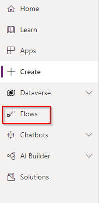

# Exasol Connector for Power Apps

## Preparation / Requirements
You should first set up the Exasol REST API in case you haven't done so. (see: https://github.com/exasol/exasol-rest-api)

## How to install the Exasol Connector for Power Apps.

Currently you'll need to use the paconn tool (installation instructions found here: https://docs.microsoft.com/en-us/connectors/custom-connectors/paconn-cli ) to create or update the connector in your organisation.

The connector talks to the exasol-rest-api which you'll also need to setup. See the section above.

### Getting the connector files

Clone this repository, download the repository zip or download the latest release from github and unzip the files.
You should have a settings file, an icon file and a 

### Using the paconn CLI tool to upload/create the connector within your organisation.

Open up a CLI/Terminal.

First you'll need to authenticate in paconn, type:
paconn login.
Follow the steps to succesfully authenticate.

Next you need to navigate to the folder where you downloaded or unzipped the connector files.

Run the following command:
paconn create -s [Path to settings.json]
You'll be prompted to select a Power Apps environment. Pick the environment where you want to install the connector.
Follow the steps.
If you get prompted to alter settings.json press 'yes' (it will update the id of the connector so you can easily update it afterwards).

### Finding the connector

If you now browse to https://make.powerapps.com/ and click on the 'Dataverse' tab to the left and then 'Custom Collectors' you should be able to see the connector.


#### Configuring the connector

You can further configure the connector via the edit icon:


Here you can enable HTTPS (it uses HTTP by default) or if you wish to use a gateway.


### Making a connection using the connector

Under the Dataverse tab, select connections.

Next, click on 'new connection'
In the search bar on the top right, search for 'custom'
You'll find the connector in the search results, select it.


A modal will pop up, you will be asked to configure the connector.


Host: which is where your rest api is hosted or available (this can be an ip address or dns name)
API Key: This is one of the authentication keys you've configured for the rest api. (This is a secure parameter so this API Key will not be retrievable afterwards in the Power Apps UI. )

(You can still edit these 2 values afterwards.)

### Testing the connector

Since you now have a connector and a connection we can test if everything is configured properly.


To do so, go back to the connector tab, edit the connector, select "Test" at the top, pick the connection you created and run some tests.

I personally always test with GetTables. 

You'll get a list of tables you have access to returned to you in the response if everything 's configured properly.

# Using the connector in a Power App

## A short overview of the available actions

As you can see from the previous screenshot you'll have 7 connector actions available to you. 

A quick overview:

##### GetTables

Returns a list of the tables visible to the database user.

##### GetRows

Returns the rows from a table based on filter conditions.

##### InsertRow

Insert a row into a table.

##### UpdateRows

Update row(s) within a table.

##### DeleteRows

Delete row(s) within a table.

##### ExecuteQuery

Run a custom query to fetch data, for more advanced scenarios.

##### ExecuteNonQuery

Run a custom command, for more advanced scenarios.


Finally, we can start using the connector via this connection in power apps. 
Click 'Create' in the left tab.

For this example we'll select 'Create from blank'

## Tutorial and examples

In this section we'll create a very simple app showcasing all functionality of the Exasol connector with working examples.

Our app will be a very simple app to display, add, remove and update a table of actors.

### Setup

We'll use the following script to setup our example table in the Exasol database:

```sql
CREATE SCHEMA PACONN;
OPEN SCHEMA PACONN;
CREATE TABLE actors (id INTEGER IDENTITY,
              lastname VARCHAR(20),
              firstname VARCHAR(20),
              age INTEGER);
```

Let's also add some data

```sql
INSERT INTO PACONN.ACTORS
(LASTNAME, FIRSTNAME, AGE)
VALUES('Schwarzenegger', 'Arnold', 74);
```


### Creating our demo app

Let's start from scratch with displaying a list of actors.

### Using a flow to fetch dynamic data

We'll use GetRows to fetch our list of actors. 

Since GetRows returns dynamic results we'll need to create a flow to define the structure of our GetRows response:

##### Creating the flow

Navigate to Flows




Select New flow, Start from Template, Template.


Select 'Power Apps button' as the base step.


Let's give our flow a readable name, let's say "Get Actors", so we can easily find it later when we'll use it in power apps.

Next, let's add a New Step, search for "Exasol" (you can also find it under 'Custom'), click the Exasol connector and then pick the "Get Rows" action.


Here you can select a schema, table and optionally filter. In our case we'll filter on age being higher than 30.

Keep in mind that at most there will be 1000 records returned.

(Note: If you need advanced filtering and ordering then you might be better served using the ExecuteQuery action which allows you complete freedom in composing a SQL Query.)

Now it's time to test.


Click 'Test', 'Manually', 'Run Flow'. You'll be able to see the output.

We see we are succesfully getting back data.


Let's make a copy of the output body for the next step (Select everything in the body with ctrl+A and then ctrl+C):

Now all that's left to do is put this dynamic data into a response and provide a json schema so we can easily use the end result. For this we'll add another step aptly called 'Response'.


As Body, pick the body of the previous step.


Under 'advanced options', select 'Generate from sample' and paste in the output body from your test run.


(You can also define the Response Body JSON Schema yourself but this is way more cumbersome.)

The step will now look like this:


If you test the flow again you'll see there's also a schema being returned now:


Save the flow. 

##### Using our new flow in our canvas app

Let's navigate back to our canvas app.

I've added a datatable, and a refresh button.

Let's add our flow to the refresh button: Click on the button, click in "onSelect" under "Advanced", then in the top "Action Tab" pick "Power Automate". Select the flow and add it.

Alter the formula like this:

```
Set(GetActorsResult,GetActors.Run());
ClearCollect(ActorsCollection,GetActorsResult.rows);
```


(I've also added this to screen onVisible)


This way, whenever we click the Refresh button or open the screen we'll store the whole response in `GetActorsResult` and the actual actors data in `ActorsCollection`.

Let's also configure our datatable to use the `ActorsCollection` so we see the actual data.


##### 

We can now already see the contents of our Actor table.


The next step is to add actors to our database.

For this we'll need to use InsertRows. InsertRows has dynamic data as an input so we'll need to create a flow to properly set this up.

Let's navigate back to flows and create a new flow, start from template and pick Power Apps Button as the base step again.

Once again, let's give it a good name (AddActor sounds good)

Now we'll need some inputs. For this we'll add a couple of steps named 'Initialize variable'.

In this case we need a first name, a last name and an age.


It's good practice to rename these steps first for readability and ease-of-use. For example :


(As you see here, the name of the step will also be part of the name of the variable that you'll have to pass in Power Apps)


This is how our 3 initialize variable steps now look.

The next step we'll add is the insert row step from our connector.


We'll configure the step as seen above, binding the variables to the corresponding columns.

And that's it for this flow. We can now test this flow again as before and add some actors.

After we're sure everything works we can head back to our app and add some Controls:
