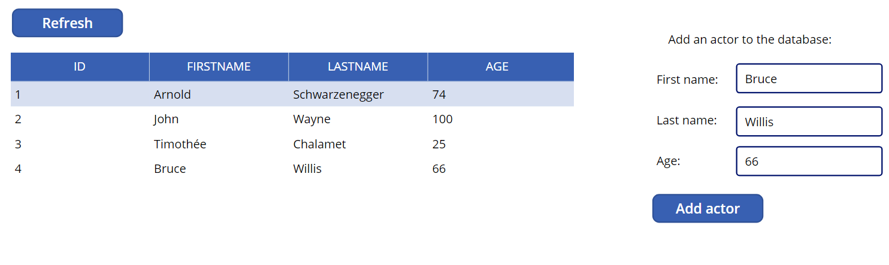
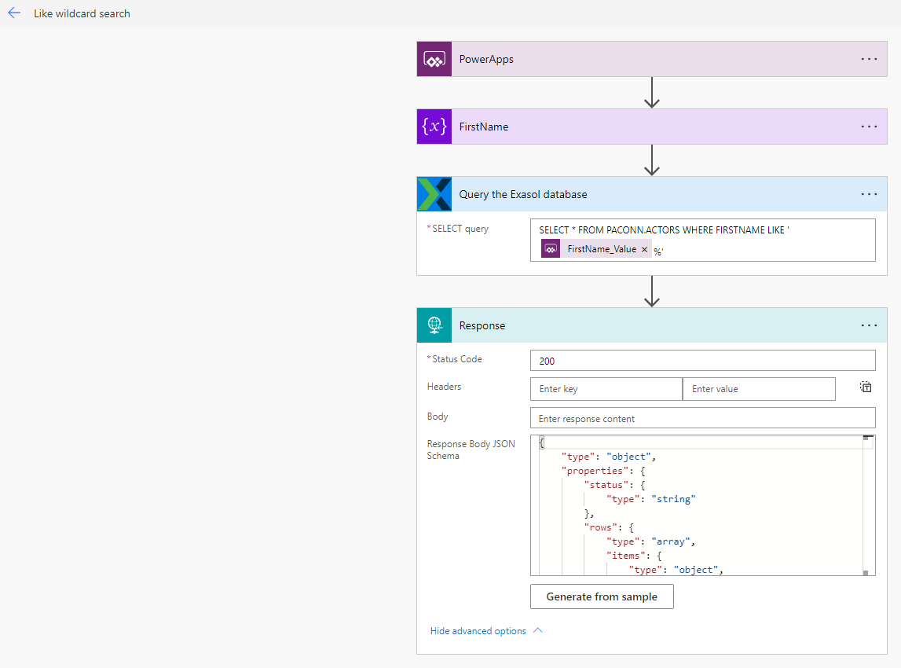

# Exasol Connector for Power Apps

## Preparation / Requirements

You should first set up the Exasol REST API in case you haven't done so. (see: https://github.com/exasol/exasol-rest-api)

## How to install the Exasol Connector for Power Apps.

Currently you'll need to use the paconn tool to  create or update the connector in your organisation.

(installation instructions found here : https://docs.microsoft.com/en-us/connectors/custom-connectors/paconn-cli ) 

The connector talks to the exasol-rest-api which you'll also need to setup. See the section above.

### Getting the connector files

Clone this repository, download the repository zip or download the latest release from github and unzip the files.
The connector consists of a settings file, an icon file and a apiDefinition.swagger.json and apiProperties.json file which describe the connector.

### Using the paconn CLI tool to upload/create the connector within your organisation.

Open up the command line or a terminal.

###### Authenticate

First you'll need to authenticate in paconn, type:
`paconn login`
Follow the steps to succesfully authenticate.

###### Creating the connector

Next you need to navigate to the folder where you downloaded or unzipped the connector files.

Run the following command:
`paconn create -s [Path to settings.json]`
You'll be prompted to select a Power Apps environment. 

Pick the environment where you want to install the connector.
Follow the steps.
If you get prompted to alter settings.json, press "yes". 

( It will update the id of the connector so you can easily update it afterwards using `paconn update -s [Path to settings.json]`).

###### Inspecting the connector we just created in our environment/organisation.

If you now browse to https://make.powerapps.com/ , pick the right organisation top right and click on the "Dataverse" tab to the left and then "Custom Connectors" you should be able to see the connector.


###### Configuring the connector

You can further configure the connector via the edit icon if you so wish (this is an optional step):


Here you can: 

- Enable HTTPS in case of the HTTP version.
  Before you do so: There's also a HTTPS version of the connector available for download.


Enabling HTTPS is a 2 step process in our connector's case, you'll also need to alter the host URL policy's Url template.

Change "http" into "https". 


Important: Enabling "Connect via on-premises data gateway" is currently NOT supported. A separate connector and instructions will be delivered on a later date.

### Making a connection using the connector

Under the "Dataverse" tab, select "Connections".

Next, click on "New connection".
In the search bar on the top right, search for "custom".

You'll find the connector in the search results, select it.


A modal will pop up, you will be asked to configure the connector.


`Host`: Where your REST API is hosted (this can be an IP address or DNS name).

`API Key`: This is one of the authentication keys you've configured to gain access to the REST API. 

This is a secure parameter so this API Key will not be retrievable afterwards in the Power Apps UI.

Note: You can still edit these 2 values afterwards.

### Testing the connector

Since we now have a connector and a connection we can test if everything is configured properly.


To do so, go back to the connector tab, edit the connector, select "Test" at the top, pick the connection you created and run some tests.

I personally always test the connector with the `GetTables` action. 

You'll get a list of tables the database user has access to returned to you in the response if everything 's configured properly.

# Using the connector in a Power App

## A short overview of the available actions

As you can see from the previous screenshot you'll have 7 connector actions available to you. 

A quick overview:

##### GetTables

Returns a list of the tables visible to the database user.

##### GetRows

Returns the rows from a table based on filter conditions.

##### InsertRow

Insert a row into a table.

##### UpdateRows

Update row(s) within a table.

##### DeleteRows

Delete row(s) within a table.

##### ExecuteQuery

Run a custom query to fetch data, for more advanced scenarios.

##### ExecuteNonQuery

Run a custom command, for more advanced scenarios.

## Next steps

This completes the setup phase and a brief overview of the actions made available through the connector. 

We can now start using the connector via the connection we made in Power Apps itself. 

For this example we'll create a new canvas app from scratch.

## Tutorial and examples

We'll create a very simple app and some flows showcasing functionality of the Exasol connector with working examples.

Our app will display, add and optionally remove and update a table of actors in our Exasol database.

#### Setup table and data for our example

We'll use the following script to setup our example table in the Exasol database:

```sql
CREATE SCHEMA PACONN;
OPEN SCHEMA PACONN;
CREATE TABLE actors (id INTEGER IDENTITY,
              lastname VARCHAR(20),
              firstname VARCHAR(20),
              age INTEGER);
```

Let's also add some data as well:

```sql
INSERT INTO PACONN.ACTORS
(LASTNAME, FIRSTNAME, AGE)
VALUES('Schwarzenegger', 'Arnold', 74);
```

#### Creating our demo app

Let's start with displaying our actors in a datatable. 

We'll use the `GetRows` action available in our connector to fetch a list of actors we store in the table we just created. 

Since `GetRows` returns dynamic results depending on our query we'll need to create a flow to define the structure of our `GetRows` response as an additional step:

#### Using a flow to fetch dynamic data

##### Creating the flow

Navigate to the "Flows" tab in the left overview pane.


Select "New flow", "Start from a template", "Template".


Select "Power Apps button" as the base step.


Let's give our flow a readable name, let's say "Get Actors", so we can easily find it later when we'll use it in power apps itself.

Next, let's add a New Step, search for "Exasol" (you can also find it under "Custom"). 


Click the Exasol connector.

You'll then get a nice overview of the actions available in the connector


Pick the "Get rows ..." action. 


Here you can input a schema,a table and optionally add a filter condition. 

Keep in mind that at most there will be 1000 records returned.

(Note: If you need advanced filtering and ordering then you might be better served using the ExecuteQuery action which allows you complete freedom in composing a SQL Query. This action is demonstrated lower in this article.)

Now it's time to test the flow we have so far:


Click "Test", "Manually", "Run Flow". You'll be able to see the output.

We see we are succesfully getting back data, including rows.


Let's make a copy of the output body to use in the next step we'll add to the flow: 
Select everything in the output body by clicking in it, and then pressing "ctrl+A" and then "ctrl+C" to copy the contents of the body.

Now all that's left to do is put this dynamic data into a response and provide a JSON schema so we can easily use the end result. 

For this we'll add another step aptly called 'Response'.


As Body we'll pick the body of the previous step.


Under "advanced options" select "Generate from sample" and paste in the output body from your test run.


(You can also define the Response Body JSON Schema yourself manually but I would not recommend it.)

The step will now look like this:


If you test the flow again you'll see the following:


Save the flow. 

##### Using our new GetActors flow in our canvas app

Let's navigate back to our canvas app.

Let's add a data table, and a refresh button in the app screen.

Let's add our flow to the refresh button: Click on the button, click in "OnSelect" under "Advanced", then in the top "Action Tab" pick "Power Automate". Select the flow and add it.

Alter the formula like this:

```
Set(GetActorsResult,GetActors.Run());
ClearCollect(ActorsCollection,GetActorsResult.rows);
```


I've also added this same code to the screen's "OnVisible" so the data will load as soon as you open the application or screen.

This way, whenever we click the Refresh button or open the screen we'll store the whole response in `GetActorsResult` and the actual actors data in `ActorsCollection`.

Let's configure our data table to use the `ActorsCollection` to visualize the data we retrieved using our GetActors flow.


If we alt-click on the refresh button or if we "play" the application we'll already see the results of our GetActors flow.

#### Adding actors to our actors table

Now that we are listing the actors from our table, a logical next step is to provide a way to easily add actors to our database.

For this we'll need to use `InsertRows` action of our Connector. 

`InsertRows` has dynamic data as an input so we'll need to create a flow to properly set this up.

##### Setting up the flow

Let's navigate back to the "Flows" section and create a new flow, 

Pick "Start from a template" and then pick "Power Apps button" as the base step again.

Let's give it a good name as before ("AddActor" sounds good).

Now we'll need some inputs. For this we'll add a couple of steps named "Initialize variable".

In this case we need a Initialize variable step for the first name, the last name and the age of the actor.


It's good practice to rename these steps first for readability and ease-of-use. For example :


(As you see here, the name of the step will also be part of the name of the variable that you'll have to pass in Power Apps)


This is how our 3 "Initialize variable" steps now look.

The next step we'll add is the "Insert row" step from our Exasol connector.


We'll configure the step as seen above, binding the variables to the corresponding columns.

As a last step we'll test this flow again as we did with the previous flow. Let's add some actors while we're at it.

After we're sure everything works as we want we can head back to our app and add the UI elements we need to easily add our actors.

##### Adding the UI elements and using the flow

This time we'll add some text boxes, some informative labels and a button.

Next we'll wire everything together in the button's OnSelect action: 

Click on the Action tab in the top menu bar, click on "Power Automate" and insert the flow we just created (in our case we called it "AddActor"). 

As input we give in our 3 textboxes' corresponding `.Text` properties.


Let's also add our previous code to fetch data and fill our ActorCollection.


The "Add actor" button's "OnSelect" action now contains the following code:

`AddActor.Run(txtFirstname.Text,txtLastName.Text,txtAge.Text);`
`Set(GetActorsResult,GetActors.Run());`
`ClearCollect(ActorsCollection,GetActorsResult.rows);`

Let's play/start our application and test it out:



As you can see we succesfully added an actor to the database.

### In conclusion

After creating these 2 flows and wiring them up to the UI you will probably begin to see a pattern:

- We create a flow for a specific action. 

We do this because of ease-of-use, reusability, to hide complexity and also out of necessity, because we are often handling dynamic data which Power Apps itself can't handle or transform.

- We wire up the flow into the UI we create for our actions.

### More Examples

What follows next are  a couple more examples of flows and actions that are possible with the connector, including some more advanced examples.

Delete an actor by ID:


 Update an actor's age by his ID:


### Advanced connector actions: 

In some cases the basic get, insert, delete and update actions of the connector will be inadequate.

For these cases we've provided 2 additional actions:

- Query the Exasol Database
- Execute a statement on the Exasol Database (INSERT, UPDATE, DELETE, etc)

These actions allow you to form and send freeform SQL statements to the API.


#### Some examples of advanced connector actions

##### Query the Exasol database

###### Custom where query with like and wildcard:

You'll probably use the 'Query the Exasol database' action when you need joins, or sorting, or when you want to trigger a stored procedure returning data.



###### Triggering a script or stored procedure and returning data:


###### Triggering a script or stored procedure and not returning data :

(Note: you can also do this using Execute statement)


#### Execute a statement on the Exasol Database (INSERT, UPDATE, DELETE, etc)

###### A custom insert:


### Issues

The connector should provide you with every action you need to work with the Exasol Database.

If anything's unclear or if there's any issue please let us know in the issues section.
